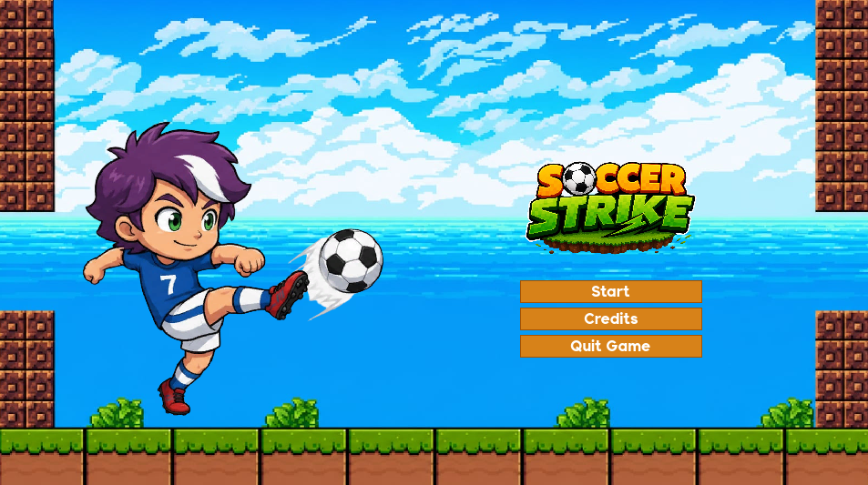
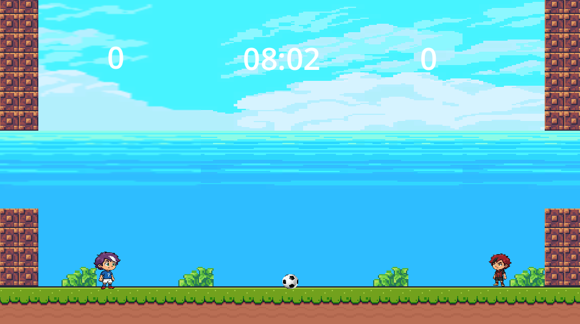
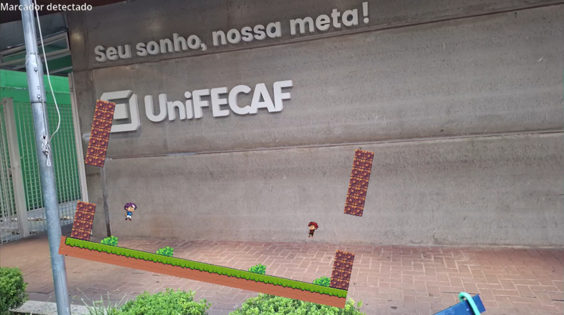
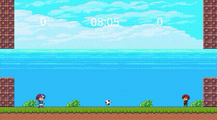

# ⚽ Soccer Striker

## 📋 Descrição

Multiplayer local, online, via smartphone e realidade aumentada utilizando Godot 4.

O projeto possui quatro modos principais:

- 🎮 Partida Local (1v1)
- 📱 Multiplayer utilizando smartphones como controle
- 🌐 Multiplayer online via conexão por IP
- 🥽 Realidade Aumentada utilizando OpenCV e marcadores ArUco

O objetivo do projeto foi desenvolver uma experiência multiplayer acessível, permitindo que jogadores utilizem diferentes dispositivos para participar das partidas.

---

# ✨ Funcionalidades

## 🎮 Modo Local (1v1)

Permite que dois jogadores joguem no mesmo computador utilizando o teclado.

### Características

- Dois jogadores simultâneos
- Controle totalmente pelo teclado
- Não requer conexão de rede
- Ideal para partidas rápidas

---

## 📱 Multiplayer via Controle Web (1v1)

Permite utilizar smartphones como controles do jogo.

### Funcionamento

1. O jogo cria um servidor WebSocket.
2. Os celulares acessam uma página web contendo os controles.
3. Os comandos são enviados em tempo real para o jogo.
4. Os jogadores controlam seus personagens diretamente pelo navegador.

### Tecnologias Utilizadas

- HTML5
- CSS3
- JavaScript
- WebSocket

### Requisitos

- Computador e celulares conectados à mesma rede Wi-Fi.
- Servidor WebSocket ativo.

---

## 🌐 Multiplayer Online (1v1)

Permite partidas entre computadores diferentes através de conexão direta utilizando IP.

### Funcionamento

1. Um jogador cria a sala (Host).
2. O endereço IP é compartilhado com o outro jogador.
3. O segundo jogador conecta ao host.
4. A partida é iniciada.

### Características

- Comunicação cliente-servidor.
- Partidas entre dispositivos diferentes.
- Baixa latência em redes locais.

---

## 🥽 Modo Realidade Aumentada

Modo experimental que utiliza visão computacional para exibir o jogo em realidade aumentada.

### Funcionamento

1. A câmera captura a imagem em tempo real.
2. O OpenCV detecta um marcador ArUco.
3. A posição e orientação do marcador são calculadas.
4. A cena do jogo é exibida sobre o marcador.
5. O usuário visualiza a partida através da tela do celular.

### Tecnologias Utilizadas

- Python
- OpenCV
- ArUco
- Visão Computacional

---

# 🛠️ Tecnologias

| Tecnologia | Finalidade |
|------------|------------|
| Godot 4 | Desenvolvimento do jogo |
| GDScript | Programação |
| HTML/CSS | Interface dos controles |
| JavaScript | Comunicação WebSocket |
| Python | Realidade aumentada |
| OpenCV | Detecção ArUco |
| ENet | Multiplayer online |

---

# 🏗️ Arquitetura do Sistema

## Multiplayer via Smartphone

```text
┌────────────┐
│ Celular 1  │
└─────┬──────┘
      │
      │ WebSocket
      │
┌─────▼──────┐
│    Jogo    │
│  Godot 4   │
└─────▲──────┘
      │
      │ WebSocket
      │
┌─────┴──────┐
│ Celular 2  │
└────────────┘
```

## Multiplayer Online

```text
┌──────────────┐
│ Host (PC 1) │
└──────┬───────┘
       │
       │ Internet / LAN
       │
┌──────▼───────┐
│ Cliente (PC2)│
└──────────────┘
```

## Realidade Aumentada

```text
Câmera
   │
   ▼
OpenCV
   │
   ▼
Detecção ArUco
   │
   ▼
Posicionamento da Cena
   │
   ▼
Visualização no Celular
```


# 📦 Requisitos

### Jogo

- Godot 4.x

### Realidade Aumentada

- Python 3.10+
- OpenCV
- OpenCV Contrib

# 🎮 Controles

## Jogador 1

- W → Mover para cima
- S → Mover para baixo
- A → Mover para esquerda
- D → Mover para direita
- Espaço → Chutar

## Jogador 2

- ↑ → Mover para cima
- ↓ → Mover para baixo
- ← → Mover para esquerda
- → → Mover para direita
- Shift → Chutar

# ▶️ Executando o Projeto

## Executar o Jogo

1. Abra o projeto na Godot 4.
2. Execute a cena principal.
3. Escolha o modo desejado no menu.

## Executar o Controle Web

1. Inicie o modo Multiplayer.
2. Mantenha os celulares conectados à mesma rede
2. Escaneie o QrCode ou acesse o link que será fornecido no lobby
4. Utilize os botões exibidos na página para controlar o jogador.

## Executar o Multiplayer Online

### Host

1. Selecione "Criar Sala".
2. Compartilhe o IP exibido.

### Cliente

1. Selecione "Entrar em Sala".
2. Digite o IP do Host.
3. Conecte-se à partida.

## Executar a Realidade Aumentada

Instale as dependências:

```bash
pip install opencv-python
pip install opencv-contrib-python
```
Execute o script:

```bash
python aruco_detector.py
```

Aponte a câmera para um marcador ArUco válido para visualizar a cena em realidade aumentada.

# 🎯 Objetivos de Aprendizagem

Este projeto foi desenvolvido para aprofundar conhecimentos em:

- Desenvolvimento de jogos com Godot 4
- Programação orientada a eventos
- Sistemas multiplayer
- Comunicação por WebSocket
- Arquiteturas cliente-servidor
- Visão computacional
- Realidade aumentada
- Integração entre múltiplas tecnologias

## 📸 Capturas de Tela









# 👨‍💻 Autores

- Anthony Menezes
- Arthur Luiz
- Lucas David Pereira Esteves
- Marcello Henrique da Silva Nunes
- Otávio Henrique Souza Silva

# 📄 Licença

Este projeto foi desenvolvido para fins acadêmicos e educacionais e está licenciado sob a MIT License.

Link Vídeo Pitch: https://youtu.be/t8h1o_gFLfA